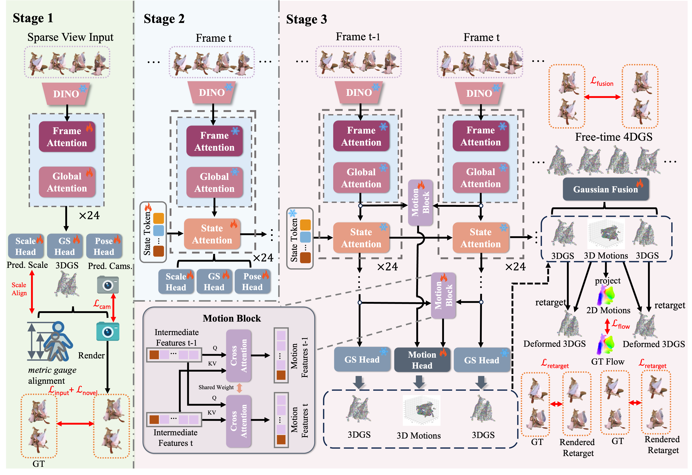

# Forge4D: Feed-Forward 4D Human Reconstruction and Interpolation from Uncalibrated Sparse Videos

[</a>](https://github.com/zhenliuZJU/Forge4D)

Codebase for Forge4D: Feed-Forward 4D Human Reconstruction and Interpolation from Uncalibrated Sparse Videos

[Yingdong Hu*](https://zhenliuzju.github.io/huyingdong/), [Yisheng He*†](https://hyshkust.github.io/), [Jinnan Chen](https://jinnan-chen.github.io/), [Weihao Yuan](https://weihao-yuan.com/), [Kejie Qiu](https://sites.google.com/site/kejieqiujack/home), [Zehong Lin](https://zhlinup.github.io/), [Siyu Zhu](https://sites.google.com/site/zhusiyucs/home), [Zilong Dong](https://scholar.google.com/citations?user=GHOQKCwAAAAJ&amp;hl=zh-CN&amp;oi=ao), [Jun Zhang](https://eejzhang.people.ust.hk/)

<p align="center"> Code under construction... 🏗️ 🚧 🔨</p>

<div  align="center">

</div>

## Videos

## Checklist
- [ ] Release inference code and pretrained checkpoint
- [ ] Release training code

## Citation
```bibtex

```
